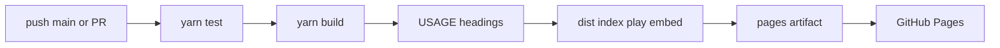

# Workflows

## Purpose

Automate **evidence and distribution** for the public showcase. This is not Wallpaper Engine packaging.

## Architecture overview

`pages.yml` runs on pull requests (test + build + usage-doc and usage-page checks) and on `main` (also upload + deploy). Enable **Settings → Pages → GitHub Actions** once on the GitHub repo. Site URL: `https://luandev.github.io/fluid-wallpaper/`. Recipes: [docs/USAGE.md](../../docs/USAGE.md).

## Paradigms

- CI uses the same scripts humans run: `yarn test`, `yarn build`.
- Corepack satisfies the pinned Yarn version from `packageManager`.
- Relative Vite `base` means the artifact is `dist/` as-is.

## Enforced patterns

- Do not call npm in workflows.
- Do not deploy from pull requests.
- Do not commit `dist/` or secrets.
- Do not add extra required local commands; Pages is CI-only.
- Keep `actions/checkout`, `setup-node` (Node 20), `upload-pages-artifact`, and `deploy-pages` as the deploy path ([DEC-007](../../docs/DECISIONS.md#dec-007--github-pages-showcase)).

## Key files

- `pages.yml`
