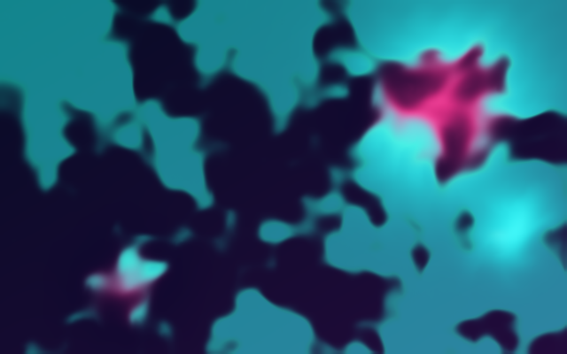
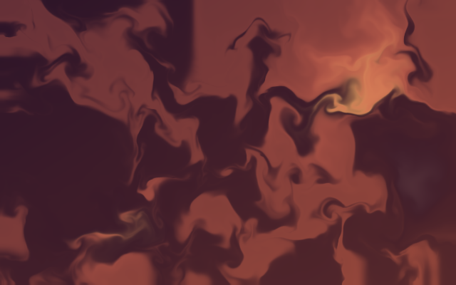
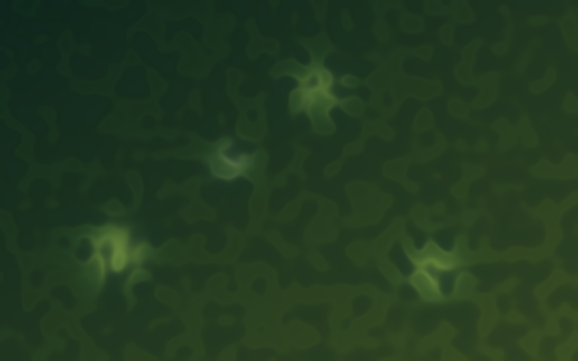
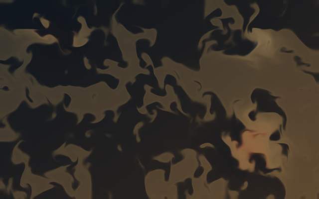

<p align="center">
  <a href="https://luandev.github.io/fluid-wallpaper/">
    
  </a>
</p>

<h1 align="center">fluid—wallpaper</h1>

<p align="center">
  Living generative ink for the web — WebGL2 fluid you can embed, tune, and leave running.
</p>

<p align="center">
  <a href="https://luandev.github.io/fluid-wallpaper/"></a>
  <a href="https://luandev.github.io/fluid-wallpaper/docs/gallery.html"></a>
  <a href="https://luandev.github.io/fluid-wallpaper/docs/"></a>
  <a href="https://www.npmjs.com/package/fluid-wallpaper"></a>
</p>

<p align="center">
  
  
  
  
  
  <a href="https://github.com/luandev/fluid-wallpaper/actions/workflows/pages.yml"></a>
</p>

<p align="center">
  <code>webgl</code>
  ·
  <code>web-components</code>
  ·
  <code>react</code>
  ·
  <code>generative-art</code>
  ·
  <code>fluid-simulation</code>
  ·
  <code>glsl</code>
  ·
  <code>ink</code>
  ·
  <code>typescript</code>
</p>

<p align="center">
  <a href="presets/aurora/preview.png"></a>
  <a href="presets/ember/preview.png"></a>
  <a href="presets/cobalt/preview.png"></a>
  <a href="presets/verdant/preview.png"></a>
  <a href="presets/porcelain/preview.png"></a>
  <a href="presets/obsidian/preview.png"></a>
</p>

---

## Welcome

**fluid-wallpaper** is ambient artwork that feels material and alive: packed pigments, soft shear, emitters, wind, and optional audio — built to drop into a page as `<fluid-ink>`, `<fluid-hero>`, or React.

| Try it | What you get |
| --- | --- |
| [Live field](https://luandev.github.io/fluid-wallpaper/) | Full-bleed landing with scene chrome |
| [Tuner](https://luandev.github.io/fluid-wallpaper/play.html) | Scene · Materials · Emitters · Wind · Drivers · Presets |
| [Gallery](https://luandev.github.io/fluid-wallpaper/docs/gallery.html) | Six starting atmospheres you can remix |
| [Shaders](https://luandev.github.io/fluid-wallpaper/docs/shaders.html) | Navier–Stokes → Stam / GPU Gems ch. 38 → WebGL2 passes |
| [Docs](https://luandev.github.io/fluid-wallpaper/docs/) | Install, heroes, settings, contribute |

North star: interesting enough to watch on purpose, efficient enough to leave running.

## Shaders & Navier–Stokes

The field is a **2D incompressible fluid** approximation of the Navier–Stokes problem: velocity carries itself, pressure projection keeps the flow roughly divergence-free, and dye concentrations ride along.

We follow the **Stam stable-fluids** method family as presented for GPUs in [GPU Gems chapter 38](https://developer.nvidia.com/gpugems/gpugems/part-vi-beyond-triangles/chapter-38-fast-fluid-dynamics-simulation-gpu) — semi-Lagrangian advection, Jacobi-style pressure, vorticity aids — implemented as **original** WebGL2 / GLSL ES 3.00 passes (no third-party fluid source pasted). Simulation transports matter; a separate display shader decides look.

- Public explainer: [docs/shaders.html](https://luandev.github.io/fluid-wallpaper/docs/shaders.html)
- Durable notes: [docs/SHADERS.md](docs/SHADERS.md)
- Pass sources: [`src/shaders/`](src/shaders/) · solver: [`src/sim/solver.ts`](src/sim/solver.ts)

## Quick start

**Install (published preview)**

```bash
npm install fluid-wallpaper@next
# or: yarn add fluid-wallpaper@next
```

Pinned build used by the public docs and CDN examples: `fluid-wallpaper@0.1.0-next.0`.

**Web component (no React required)**

```html
<script type="module">
  import { defineFluidInk } from "fluid-wallpaper/element";
  defineFluidInk();
</script>
<fluid-ink quality="eco" style="height: 320px">
  <p slot="fallback">This artwork needs WebGL2.</p>
</fluid-ink>
```

**No bundler**

```html
<fluid-ink quality="eco" style="height: 320px"></fluid-ink>
<script
  type="module"
  src="https://cdn.jsdelivr.net/npm/fluid-wallpaper@0.1.0-next.0/element-auto.js"
></script>
```

**React**

```tsx
import { FluidHero } from "fluid-wallpaper/react";
import "fluid-wallpaper/styles.css";

export function Banner() {
  return (
    <FluidHero preset="aurora" glass>
      <h1>Your headline, in motion.</h1>
    </FluidHero>
  );
}
```

More recipes: [docs/USAGE.md](docs/USAGE.md) · [package guide](docs/PACKAGE_README.md) · [live docs](https://luandev.github.io/fluid-wallpaper/docs/)

## Status

| | |
| --- | --- |
| **Ready to explore** | Browser WebGL2 field, native element, React embed, public docs/gallery, preview npm package |
| **In progress** | Believable ink mixing, mobile performance, Wallpaper Engine properties |
| **Experimental** | [Two-liquid](docs/TWO_LIQUID.md) transport / absorption — not a release guarantee |
| **Priority** | Ink-first web component ([DEC-010](docs/DECISIONS.md#dec-010--ink-first-web-component-product-direction)) |

## Develop locally

Yarn only (`npm install` is rejected).

```bash
yarn install
yarn dev      # landing at /
yarn test
yarn build   # package-dist/ + dist/ (Pages)
```

| Path | Purpose |
| --- | --- |
| `/` | Editorial landing |
| `/play.html` | Tabbed tuner (**H** panel, **P** perf, **F** fullscreen) |
| `/embed.html` | React `<FluidField />` |
| `/liquid.html` | Experimental two-liquid studio |
| `/diagnostics.html` | GPU probes |

Tunings and panel positions persist in `localStorage`. Presets use `fluid-wallpaper.preset.v1` JSON.

Pages deploy from `dist/` via GitHub Actions ([DEC-007](docs/DECISIONS.md#dec-007--github-pages-showcase)). Enable **Settings → Pages → GitHub Actions** if the site is empty. Release flow: [docs/RELEASE.md](docs/RELEASE.md).

### Wallpaper Engine (later)

Do not import this Git repo into Wallpaper Engine. When packaging, use `dist/play.html` from a production build. User properties are Phase 4.

## Docs map

| Start | Dig deeper |
| --- | --- |
| [Usage](docs/USAGE.md) | [Architecture](docs/ARCHITECTURE.md) · [Shaders](docs/SHADERS.md) · [Engineering guide](docs/ENGINEERING_GUIDE.md) |
| [Contributing](CONTRIBUTING.md) | [Roadmap](docs/ROADMAP.md) · [Open questions](docs/OPEN_QUESTIONS.md) |
| [Project](docs/PROJECT.md) | [Decisions](docs/DECISIONS.md) · [Context map](docs/CONTEXT_MAP.md) |
| [Agent instructions](AGENTS.md) | [AI-assisted development](docs/AI_ASSISTED_DEVELOPMENT.md) |

## Repository layout

| Path | Owns |
| --- | --- |
| `docs/` | Product, architecture, decisions, research |
| `src/` | Simulation, render, inputs, React, element, landing |
| `presets/` | Gallery starting points + capture artwork |
| `tests/` | Vitest CPU utilities |
| `scripts/` | Yarn guard, package/release gates |
| `.github/workflows/` | Pages CI + npm tag releases |
| `assets/` | Project references (not shipped in `dist/`) |

---

<p align="center">
  <a href="https://luandev.github.io/fluid-wallpaper/">Open the live field</a>
  ·
  <a href="CONTRIBUTING.md">Contribute</a>
  ·
  <a href="LICENSE">MIT</a>
</p>
