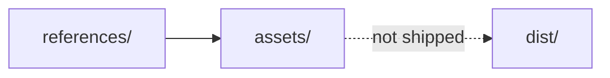

# Assets

## Purpose

Store **project-owned or properly licensed** source assets used during development. This folder is not the Wallpaper Engine package and is not copied into the Vite `dist/` bundle.

## Architecture overview

Runtime chrome (dashboard CSS, canvas) lives in `src/` and `index.html`. Stills and licensed references live under `references/` for humans and agents, not for the solver.

## Paradigms

- Provenance first: an asset without license notes is not done.
- Keep binaries and personal captures out of git.

## Enforced patterns

For every external asset, record origin and author, license and attribution, whether modification and redistribution are permitted, and the date terms were checked.

- Do not commit generated binaries, large captures, personal data, or unlicensed references.
- Do not place Workshop packages or `project.json` here.
- Do not import these files from shaders unless a later task adds a licensed, documented texture pipeline.

## Key files

- `references/README.md` — stills used while developing looks
