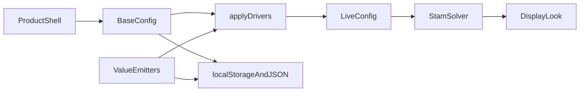

# Architecture boundaries

This document is the **system** map. Folder READMEs under `src/`, `tests/`, `docs/`, `scripts/`, and `assets/` give local purpose, architecture, paradigms, and enforced patterns. Do not silently settle questions in [OPEN_QUESTIONS.md](OPEN_QUESTIONS.md); record choices in [DECISIONS.md](DECISIONS.md).

## Direction

This maps current implementation boundaries. [CONTEXT_MAP.md](CONTEXT_MAP.md) links scoped agent guidance; [ENGINEERING_GUIDE.md](ENGINEERING_GUIDE.md) records actual call paths and known gaps. The native element exists under DEC-012. DEC-013 adds an opt-in scene path: `FluidInkElement → LiquidEngine → LiquidSolver/LiquidDisplay`, with `LiquidQualityController` and `GpuTiming` observing runtime cost. [TWO_LIQUID.md](TWO_LIQUID.md) owns its numerical contract and unfinished acceptance. A compiled package layout/release remains separate.

The wallpaper is a living fluid field, not a baked loop. Simulation **transports concentrations**. Rendering **interprets look**. The product shell **edits base settings** and must not write 60fps live values into storage. Optional inputs may disappear without breaking the artwork.

- **Base config** is what the dashboard, `localStorage`, and portable presets store (including the driver graph).
- **Live config** is `applyDrivers(base, elapsed)` each tick. The solver holds that object identity.
- Overlay drag positions (`fluid-wallpaper.panels.v1`) are shell chrome, not look data.
- The React tuner is split modules under `src/ui` (shell, tabs, graph, spatial overlay), not a single `Dashboard.tsx`.
- Portable presets use `kind: "fluid-wallpaper.preset.v1"` and the same `sanitizeConfig` path as localStorage.

## Product shell

Owns settings, presets, lifecycle events, user-facing state, the **React dashboard overlay**, and platform coordination. Overlay positions persist in `localStorage` separately from look config. React does not own simulation or the renderer ([DEC-006](DECISIONS.md#dec-006--react-product-shell-dashboard-and-value-drivers)).

Source: `src/app` (engine, config, storage, presets, drivers), `src/ui` (React overlay modules: shell, tabs, graph, spatial markers), and `src/react` (`FluidField` host).

## Simulation

Owns evolving fields such as motion, pressure-like constraints, pigment **concentrations**, density, thickness, or other material signals.

The simulation moves and transforms fields. It does not decide the final visual material. Dye stores up to four concentration channels, not painted RGB. A derived viscosity weight may damp velocity where a material is dense; that is thickness, not look ([DEC-005](DECISIONS.md#dec-005--packed-material-concentrations-and-25d-look)).

Source: `src/sim` plus simulation passes in `src/shaders`.

## Rendering

Owns color interpretation, surface detail, normals, lighting, material response, tone mapping, glow, and final presentation.

The same concentration field should support multiple visual identities (glow, sheen, roughness, metal) mixed by channel weight. Canvas alpha can reveal a video underlay when `videoReveal` is raised ([DEC-009](DECISIONS.md#dec-009--optional-youtube-music-and-web-audio-drivers)).

Source: `src/render` plus `display.frag.glsl`.

## Inputs

Owns optional pointer, **sparse 2D wind stations**, **value emitters** (waves plus optional Web Audio pulse/spectrum; camera / tilt as stubs), YouTube music id, sensor, or external-data adapters. Wind stations are procedural stand-ins for weather-sample points (heading, speed, spin). Live METAR/GRIB/API feeds stay a later optional adapter. Every input must be bounded, optional, and able to disappear without breaking the artwork.

Source: `src/inputs` for pointer, YouTube id parse, and the Web Audio analyser; wind stations and value emitters live on config in `src/app`. The compact YouTube player is product-shell UI (`src/ui`), not the solver.

## Platform integration

Owns host lifecycle and future Wallpaper Engine property/audio APIs. Packaging for ambient desktop installs uses the shared `wallpaper.html` entry and `yarn pack:wallpaper` ([DEC-019](DECISIONS.md#dec-019---multi-host-html-wallpaper-pack)); WE/Lively property listeners remain later.

Source today: `src/platform` (browser visibility/resize). Wallpaper Engine adapter APIs remain a later module.

## Quality management

Owns frame-time observation and adaptive choices such as simulation resolution, iteration budgets, update rate, and optional rendering effects.

Source today: `src/quality` (fixed Phase 1 budgets). Adaptive quality is later.

## Folder map

- `src/app` — lifecycle, config, drivers, storage, presets, overlay layout
- `src/ui` — React product-shell overlay only
- `src/react` — optional `FluidField` host and Pages embed demo ([DEC-008](DECISIONS.md#dec-008--react-fluidfield-embed))
- `src/landing` — public live-fluid showcase (`index.html`)
- `src/sim` — WebGL2 resources and Stam solver
- `src/render` — look from concentrations
- `src/inputs` — optional pointer, YouTube id parse, Web Audio analyser
- `src/platform` — browser canvas/visibility
- `src/quality` — documented budgets
- `src/shaders` — GLSL ES 3.00 sources (`?raw`)
- `tests` — CPU Vitest only
- `docs` — product facts and decisions
- `scripts` — Yarn-only install guard
- `assets` — licensed source assets, not shipped in `dist/`

## Boundaries to preserve

- Platform APIs should not leak into the simulation core.
- Rendering materials should not be baked into fluid transport.
- External data should never be required for a complete visual experience.
- Quality changes should be centralized and observable.
- Experimental paths should remain replaceable until validated.

## Leading technical direction

Confirmed in [DEC-003](DECISIONS.md#dec-003--typescript-vite-webgl2-and-glsl): TypeScript application logic, Vite for development and static builds, WebGL2 + GLSL ES 3.00 for simulation and display. The in-page tuner is a React overlay ([DEC-006](DECISIONS.md#dec-006--react-product-shell-dashboard-and-value-drivers)). Other React apps can mount the same field through `FluidField` ([DEC-008](DECISIONS.md#dec-008--react-fluidfield-embed)). The browser adapter lives in `src/platform`; Wallpaper Engine integration remains a later platform module. Simulation transports concentrations and may apply derived thickness; the renderer owns look ([DEC-002](DECISIONS.md#dec-002--separate-simulation-from-appearance), [DEC-005](DECISIONS.md#dec-005--packed-material-concentrations-and-25d-look)). Yarn only ([DEC-004](DECISIONS.md#dec-004--yarn-only)). Vite `base` stays `'./'`.
