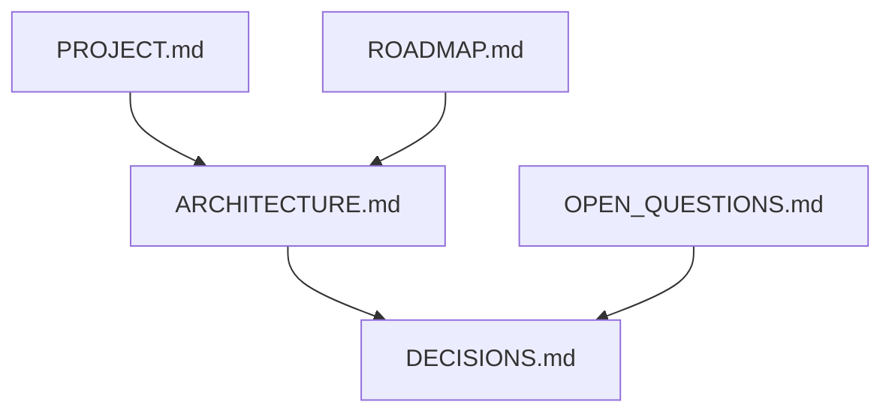

# Docs

## Purpose

[TWO_LIQUID.md](TWO_LIQUID.md) owns the experimental scene contract, numerical assumptions, reference provenance, measured GPU results and unfinished acceptance gates.

Hold **product facts, architecture, roadmap, and decisions** so the code and agents share one direction. Implementation lives in `src/`. This folder does not run the wallpaper.

## Architecture overview

- [PROJECT.md](PROJECT.md) — vision and first-release bar
- [CONTEXT_MAP.md](CONTEXT_MAP.md) — folder-by-folder agent guidance and document ownership
- [ENGINEERING_GUIDE.md](ENGINEERING_GUIDE.md) — runtime semantics, change recipes, persistence, validation, and known findings
- [ARCHITECTURE.md](ARCHITECTURE.md) — system map and boundaries
- [USAGE.md](USAGE.md) — landing, tuner, React `FluidField`, vanilla Engine
- [REVIEW_INK_COMPONENT.md](REVIEW_INK_COMPONENT.md) — source critique and proposed ink, mobile, and web component direction (not accepted decisions)
- [DECISIONS.md](DECISIONS.md) — accepted tradeoffs with evidence
- [Landing README](../src/landing/README.md) — public showcase page
- [OPEN_QUESTIONS.md](OPEN_QUESTIONS.md) — unresolved; do not implement as if decided
- [ROADMAP.md](ROADMAP.md) — phase outcomes
- [AI_ASSISTED_DEVELOPMENT.md](AI_ASSISTED_DEVELOPMENT.md) — how agents should read `AGENTS.md`

Folder READMEs are local architecture; scoped AGENTS.md files guide edits. They must remain consistent with this set. See [local documentation guidance](AGENTS.md).

## Paradigms

- Documentation-first for durable choices ([DEC-001](DECISIONS.md)).
- Separate findings from proposals. Link primary sources when recording a DEC.
- Phase text describes outcomes, not a secret second stack.

## Enforced patterns

- Do not silently settle an open question in a README or a PR description — add a DEC or leave it open.
- Update this folder when scope, interfaces, or assumptions change (`AGENTS.md`).
- DEC-010 records ink/component product priority only; the review's optics, API, workspace, and quality suggestions remain proposed.
- Do not commit secrets. Do not treat agent instructions as a security boundary.
- Keep Wallpaper Engine packaging guidance: import `dist/play.html` for the tuner, never the Git tree, until Phase 4 says otherwise. `dist/index.html` is the GitHub Pages landing; `dist/embed.html` is the React usage demo.

## Key files

- `ARCHITECTURE.md`, `DECISIONS.md`, `PROJECT.md`, `ROADMAP.md`, `OPEN_QUESTIONS.md`, `USAGE.md`

[RELEASE.md](RELEASE.md) owns compiled-package artifacts, CI publication, bootstrap instructions and validation status. [PACKAGE_README.md](PACKAGE_README.md) is copied into the npm artifact.

[ECO.md](ECO.md) owns adaptive ECO resolution, pacing, simulation speed, continuity and measurement limits.

The public browser documentation lives at [index.html](index.html): [settings](settings.html), [hero](hero.html), [gallery](gallery.html), and [preset contribution guide](contributing-presets.html). Engineering Markdown remains repository documentation.
