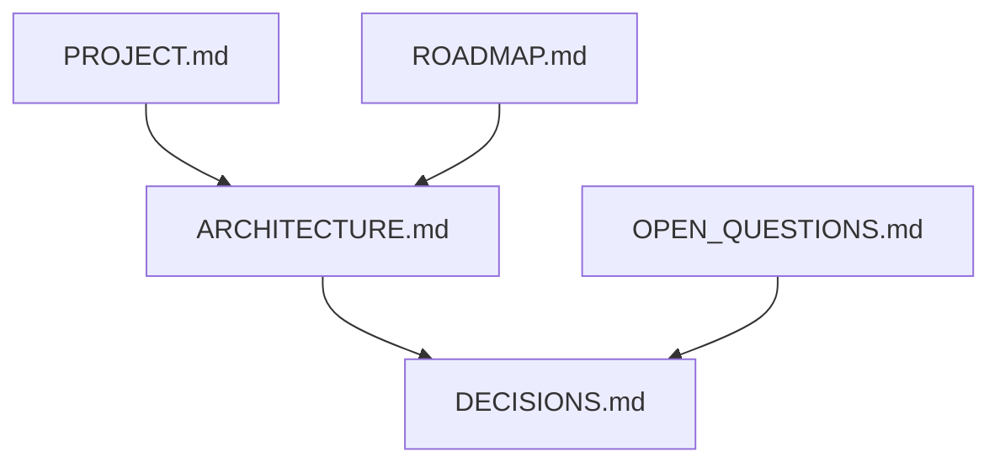

# Docs

## Purpose

Hold **product facts, architecture, roadmap, and decisions** so the code and agents share one direction. Implementation lives in `src/`. This folder does not run the wallpaper.

## Architecture overview

- [PROJECT.md](PROJECT.md) — vision and first-release bar
- [ARCHITECTURE.md](ARCHITECTURE.md) — system map and boundaries
- [USAGE.md](USAGE.md) — landing, tuner, React `FluidField`, vanilla Engine
- [DECISIONS.md](DECISIONS.md) — accepted tradeoffs with evidence
- [Landing README](../src/landing/README.md) — public showcase page
- [OPEN_QUESTIONS.md](OPEN_QUESTIONS.md) — unresolved; do not implement as if decided
- [ROADMAP.md](ROADMAP.md) — phase outcomes
- [AI_ASSISTED_DEVELOPMENT.md](AI_ASSISTED_DEVELOPMENT.md) — how agents should read `AGENTS.md`

Folder READMEs under `src/` are local architecture; they must not contradict this set.

## Paradigms

- Documentation-first for durable choices ([DEC-001](DECISIONS.md)).
- Separate findings from proposals. Link primary sources when recording a DEC.
- Phase text describes outcomes, not a secret second stack.

## Enforced patterns

- Do not silently settle an open question in a README or a PR description — add a DEC or leave it open.
- Update this folder when scope, interfaces, or assumptions change (`AGENTS.md`).
- Do not commit secrets. Do not treat agent instructions as a security boundary.
- Keep Wallpaper Engine packaging guidance: import `dist/play.html` for the tuner, never the Git tree, until Phase 4 says otherwise. `dist/index.html` is the GitHub Pages landing; `dist/embed.html` is the React usage demo.

## Key files

- `ARCHITECTURE.md`, `DECISIONS.md`, `PROJECT.md`, `ROADMAP.md`, `OPEN_QUESTIONS.md`, `USAGE.md`
