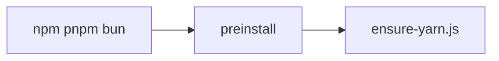

# Scripts

## Purpose

Guard **repository mechanics** that must not depend on the fluid solver. Today that is the Yarn-only install check.

## Architecture overview

`package.json` `preinstall` runs `node ./scripts/ensure-yarn.js`. `engines.npm` is `please-use-yarn`. This keeps one lockfile ([DEC-004](../docs/DECISIONS.md#dec-004--yarn-only)).

## Paradigms

- Fail fast at install time rather than debugging mixed lockfiles later.
- Keep scripts tiny, dependency-free, and testable from Vitest where it matters.

## Enforced patterns

- Do not add npm as an allowed installer.
- Do not put WebGL, React, or config sanitize in this folder.
- New repo-level guards belong here only if they are package-manager or hygiene checks, not product features.
- Use Yarn for `yarn`, `yarn test`, and `yarn build`.

## Key files

- `ensure-yarn.js`
- `../tests/ensure-yarn.test.ts`
