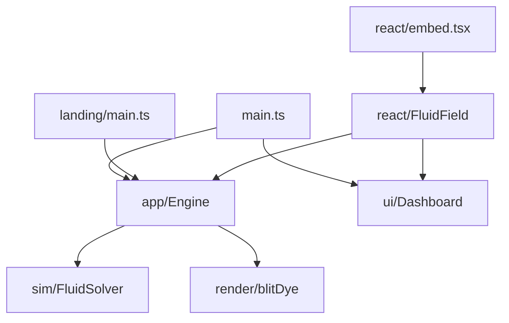

# Source

## Purpose

`src/` is the runnable wallpaper: WebGL2 fluid, TypeScript engine, React tuner overlay, a dashboard-free landing showcase, and an optional React `FluidField` host.

## Architecture overview

`main.ts` boots the **tuner** (`play.html`): canvas, stored base config, engine, dashboard, perf HUD. `landing/main.ts` boots the **showcase** (`index.html`): same engine, no React overlay. `react/embed.tsx` boots **embed.html**: `<FluidField />` with or without the dashboard.

Child folders are contracts, not a junk drawer. The engine owns the frame loop. React never steps the solver. The tuner overlay is split modules under `src/ui`. Shaders stay original Stam / GPU Gems ch. 38 family work, not a copied demo.

System map: [docs/ARCHITECTURE.md](../docs/ARCHITECTURE.md).

Editing context: [AGENTS.md](AGENTS.md), [all folders](../docs/CONTEXT_MAP.md), and [engineering recipes](../docs/ENGINEERING_GUIDE.md). The native element exists as a source adapter. The opt-in [two-liquid path](../docs/TWO_LIQUID.md) uses `app/liquidEngine.ts`, `sim/liquidSolver.ts`, `render/liquidDisplay.ts`, and `quality/liquidQuality.ts`; its studio and GPU fixture are additional Vite entries, not a compiled package release.

## Paradigms

- Simulation transports concentrations; rendering paints look ([DEC-002](../docs/DECISIONS.md), [DEC-005](../docs/DECISIONS.md)).
- React is product-shell UI only ([DEC-006](../docs/DECISIONS.md)). `FluidField` is a host, not a solver ([DEC-008](../docs/DECISIONS.md)).
- Optional inputs must be able to vanish ([DEC-009](../docs/DECISIONS.md) audio is off until Listen).
- Prefer small, reviewable modules over a single mega-file.

## Enforced patterns

- Yarn only; Vite `base: './'`.
- Do not add Wallpaper Engine `project.json` or WebGPU unless a task explicitly asks. Keep fluid passes original; external source reuse needs explicit license review.
- Persist **base** config and driver graph, never 60fps live values.
- Keep `controlSchema` / sanitize / caps in `app/config.ts` as the gate for stored looks.

## Key files

- `main.ts` — boot, HMR dispose
- [landing/README.md](landing/README.md) — GitHub Pages showcase, no dashboard
- [react/README.md](react/README.md) — `FluidField` package export
- [element/README.md](element/README.md) — framework-neutral `<fluid-ink>` adoption host
- [app/README.md](app/README.md), [ui/README.md](ui/README.md), [sim/README.md](sim/README.md), [render/README.md](render/README.md), [inputs/README.md](inputs/README.md), [platform/README.md](platform/README.md), [quality/README.md](quality/README.md), [shaders/README.md](shaders/README.md)
