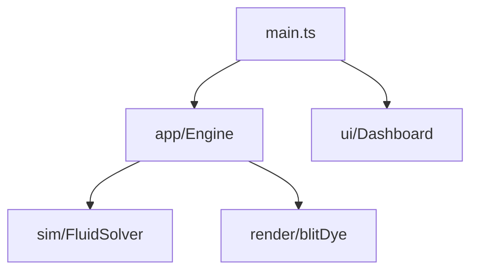

# Source

## Purpose

`src/` is the runnable wallpaper: a WebGL2 fluid field, a TypeScript engine, and a React overlay for artists. `main.ts` boots the canvas, loads stored **base** config, starts the engine, then mounts the dashboard and perf HUD.

## Architecture overview

Child folders are contracts, not a junk drawer. The engine owns the frame loop. React never steps the solver. Shaders stay original Stam / GPU Gems ch. 38 family work, not a copied demo.

System map: [docs/ARCHITECTURE.md](../docs/ARCHITECTURE.md).

## Paradigms

- Simulation transports concentrations; rendering paints look ([DEC-002](../docs/DECISIONS.md), [DEC-005](../docs/DECISIONS.md)).
- React is product-shell UI only ([DEC-006](../docs/DECISIONS.md)).
- Optional inputs must be able to vanish.
- Prefer small, reviewable modules over a single mega-file.

## Enforced patterns

- Yarn only; Vite `base: './'`.
- Do not add Wallpaper Engine `project.json`, WebGPU, or copied third-party fluid source unless a task explicitly asks.
- Persist **base** config and driver graph, never 60fps live values.
- Keep `controlSchema` / sanitize / caps in `app/config.ts` as the gate for stored looks.

## Key files

- `main.ts` — boot, HMR dispose
- [app/README.md](app/README.md), [ui/README.md](ui/README.md), [sim/README.md](sim/README.md), [render/README.md](render/README.md), [inputs/README.md](inputs/README.md), [platform/README.md](platform/README.md), [quality/README.md](quality/README.md), [shaders/README.md](shaders/README.md)
