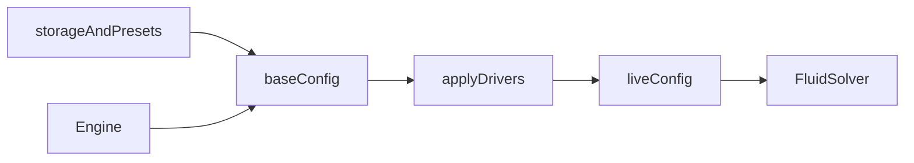

# App

## Purpose

Own the wallpaper’s **lifecycle and authored state**: config, engine, storage, presets, value drivers, overlay layout, and CPU look helpers. This is the product shell’s TypeScript core. It is not React and not GLSL.

## Architecture overview

`Engine.getConfig()` returns **base**. `getLiveConfig()` is for readouts. `applyConfig` patches base only. Each tick copies `applyDrivers(base, elapsed)` onto the solver’s live object. Portable JSON presets use the same sanitize path as `fluid-wallpaper.presets.v1`.

## Paradigms

- Sanitize at every boundary (`clampConfig` / `sanitizeConfig`).
- Deep-clone arrays (materials, emitters, wind, value emitters, bindings) so storage cannot alias live.
- Drivers mix `base → driven` by `amount`. Each value emitter has `scale` (default 1): mix is `from↔to` around the midpoint, so scale 1 is today’s A↔B tween. Stubs (`mic`, `camera`, `tilt`) sample `0.5` and request no permissions.
- Overlay positions are chrome (`fluid-wallpaper.panels.v1`), not part of a look.

## Enforced patterns

- Max 4 materials, 8 emitters, 8 wind stations, 8 value emitters, 16 bindings, 32 presets.
- Do not bind reseed/quality keys (`simResolution`, `dyeResolution`, `pressureIterations`, `warmupSteps`, `viewZoom`) or hex colors.
- Preset files must be `{ kind: "fluid-wallpaper.preset.v1", presets: [...] }`. Import **merges by name**; it does not wipe the library.
- No `getUserMedia` / DeviceOrientation here. No Wallpaper Engine APIs.
- Do not write live values in `saveStoredConfig`.

## Key files

- `config.ts` — `FluidConfig`, schema, sanitize, bindable paths
- `fieldHelp.ts` — copy for material / emitter / wind / driver fields
- `engine.ts` — base vs live, frame loop
- `drivers.ts` — waves, `scale`, `applyDrivers`
- `storage.ts` — look config `v9`
- `presets.ts` — localStorage + serialize/parse/merge
- `panelLayout.ts` / `dragPanel.ts` — overlay positions
- `perfHud.ts` — P toggles; uses `src/ui/shortcuts.ts`
- `wind.ts`, `colorTween.ts`, `shade.ts`
