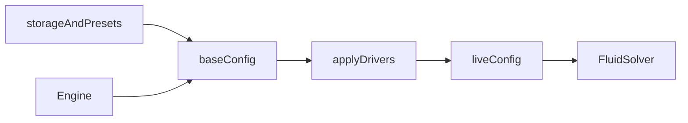

# App

## Purpose

The opt-in `liquidScene.ts` owns the versioned two-phase contract; `liquidEngine.ts` owns its frame loop and lifecycle. `liquidDiagnostics.ts` is the deterministic browser GPU fixture entry. These do not reinterpret legacy `FluidConfig`. See [contract and current limits](../../docs/TWO_LIQUID.md).

Own the wallpaper’s **lifecycle and authored state**: config, engine, storage, presets, value drivers, overlay layout, and CPU look helpers. This is the product shell’s TypeScript core. It is not React and not GLSL.

## Architecture overview

`Engine.getConfig()` returns **base**. `getLiveConfig()` is for readouts. `applyConfig` patches base only. Each tick copies `applyDrivers(base, elapsed, audioFrame)` onto the solver’s live object. Portable JSON presets use the same sanitize path as `fluid-wallpaper.presets.v1`. Fresh installs use the hard-mix look: four corner point emitters, four wind stations, a triangle wave on `noiseTime`, and example audio drivers (Kick / Bass / Highs) plus a YouTube music id. Analysis is idle until Listen.

## Paradigms

- Sanitize at every boundary (`clampConfig` / `sanitizeConfig`).
- Deep-clone arrays (materials, emitters, wind, value emitters, bindings) so storage cannot alias live.
- Drivers mix `base → driven` by `amount`. Each value emitter has `scale` (default 1): mix is `from↔to` around the midpoint, so scale 1 is today’s A↔B tween. `audioPulse` / `audioSpectrum` read a live FFT frame (0 when idle). Stubs (`camera`, `tilt`) sample `0.5` and request no permissions.
- Overlay positions are chrome (`fluid-wallpaper.panels.v1`), not part of a look.

## Enforced patterns

- Max 4 materials, 8 emitters, 8 wind stations, 8 value emitters, 16 bindings, 32 presets.
- Do not bind reseed/quality keys (`simResolution`, `dyeResolution`, `pressureIterations`, `warmupSteps`, `viewZoom`) or hex colors.
- Preset files must be `{ kind: "fluid-wallpaper.preset.v1", presets: [...] }`. Import **merges by name**; it does not wipe the library.
- No DeviceOrientation here. No Wallpaper Engine APIs. `getUserMedia` / `getDisplayMedia` live in `src/inputs/audioAnalyser.ts`, started from Engine after a Drivers gesture.
- Do not write live values in `saveStoredConfig`.

## Key files

- `config.ts` — `FluidConfig`, schema, sanitize, bindable paths, crimson base defaults
- `fieldHelp.ts` — copy for material / emitter / wind / driver fields
- `engine.ts` — base vs live, frame loop, audio sample
- `drivers.ts` — waves, audio frame mix, `scale`, `applyDrivers`
- `storage.ts` — look config `v9`; `hasStoredConfig` for embeds
- `presets.ts` — localStorage + serialize/parse/merge
- `panelLayout.ts` / `dragPanel.ts` — overlay positions
- `perfHud.ts` — P toggles; uses `src/ui/shortcuts.ts`
- `wind.ts`, `colorTween.ts`, `shade.ts`

Engine exposes optional constructor ECO settings, `setEcoMode` and `getEcoStatus`. Adaptive overrides stay separate from authored configuration. LiquidEngine also applies shared ECO scaling and reports simulationSpeed. See [ECO.md](../../docs/ECO.md).

Background mode/colors are portable authored config; see [usage](../../docs/USAGE.md#backgrounds). Legacy presets without the mode migrate to video with reveal enabled. Display-only changes do not reseed.
