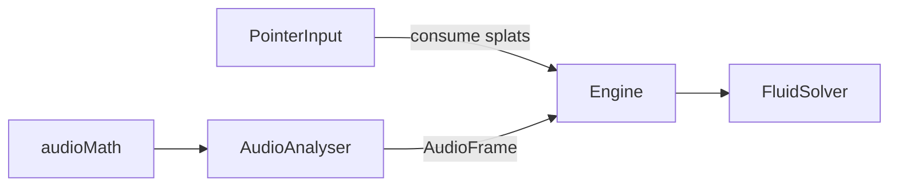

# Inputs

## Purpose

Feed **optional**, bounded interaction into the solver. Pointer stir, YouTube id parse, and Web Audio analysis live here. The artwork must remain complete when this folder does nothing.

## Architecture overview

Wind stations and value emitters are authored on `FluidConfig` (`src/app`). Camera/tilt stay Phase 5 stubs in drivers. YouTube **picture** is a compact player in `src/ui`; this folder only parses ids. While the tuner’s Emitters or Wind tab is placing UV markers, an HTML overlay in `src/ui/spatial` sits over `#view` and captures pointer so stir does not fire under the gizmo.

## Paradigms

- Optional: disable pointer, leave audio off, and the composer still paints.
- Bounded: splats use config radii/forces; FFT is 32 log bands in `[0,1]`.
- Privacy: media capture starts only after a user gesture on Engine (`setAudioSource`). Landing uses the same Engine with an idle analyser but never starts capture.

## Enforced patterns

- Do not import React.
- Do not call Wallpaper Engine audio APIs until a platform adapter exists ([DEC-009](../../docs/DECISIONS.md)).
- Keep pointer enablement on **base** config (`pointerEnabled`); the engine applies it.
- Fail closed: permission deny or missing tab audio → silent frame.
- Placement UI lives in `src/ui/spatial`; this folder has no React. Its current body portal is broader than the canvas and is a known embed limitation, documented in the engineering guide.

## Key files

- `pointer.ts` — mouse/touch splats for the solver
- `youtubeId.ts` — parse / sanitize watch URLs
- `audioMath.ts` — log bands and onset pulse (CPU, tested)
- `audioAnalyser.ts` — mic / tab capture → `AudioFrame`

youtubeApi.ts lazily loads the official YouTube iframe API only for the optional mounted music player. It does not capture audio or request microphone/tab permissions.
