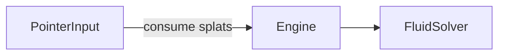

# Inputs

## Purpose

Feed **optional**, bounded interaction into the solver. Today that is pointer/touch stir. The artwork must remain complete when this folder does nothing.

## Architecture overview

Wind stations and value emitters are authored on `FluidConfig` (`src/app`), not as platform device APIs. Real mic/camera/tilt adapters stay Phase 5 stubs in drivers.

## Paradigms

- Optional: disable pointer and the composer still paints.
- Bounded: splats use config radii/forces; no unbounded event queues into GLSL.
- Privacy: do not attach media devices from this folder.

## Enforced patterns

- No `getUserMedia`, DeviceOrientation, or audio analysis here.
- Do not import React.
- Do not call Wallpaper Engine input APIs until a platform adapter exists.
- Keep pointer enablement on **base** config (`pointerEnabled`); the engine applies it.

## Key files

- `pointer.ts` — mouse/touch splats for the solver
