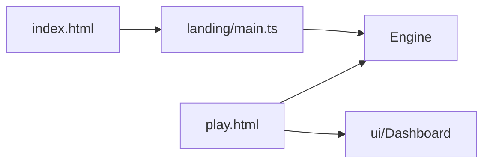

# Landing

## Purpose

Public **showcase** for the wallpaper: a full-viewport WebGL2 field with editorial chrome. It must feel like the product, not a screenshot. The tuner lives at `play.html`.

## Architecture overview

Vite is a two-page app (`index.html`, `play.html`) with `base: './'`. GitHub Pages deploys `dist/`. The landing starts `Engine` with stored **base** config (or defaults) and does **not** mount the React dashboard. Pointer stir still works on the canvas; the glass copy uses `pointer-events: none` except links.

## Paradigms

- The hero **is** the simulation. Marketing never replaces the field with a fake loop.
- React stays off this page ([DEC-006](../../docs/DECISIONS.md#dec-006--react-product-shell-dashboard-and-value-drivers)).
- Same engine, same shaders, same look pipeline as the tuner.

## Enforced patterns

- Keep Vite `base: './'` so Pages, local `dist/`, and Wallpaper Engine all resolve assets ([DEC-007](../../docs/DECISIONS.md#dec-007--github-pages-showcase)).
- Do not mount `#dash` / perf HUD here.
- Do not add MUI, analytics SDKs, or getUserMedia.
- Yarn only for the Pages workflow (`yarn test`, `yarn build`).
- Google Fonts are decorative; the field must still run if they fail to load.

## Key files

- `main.ts` — boot Engine, fatal overlay, HMR
- `landing.css` — shell, bento, marquee
- `../../index.html` — markup
- `../../play.html` — tuner entry
- `../../.github/workflows/pages.yml` — CI/CD
