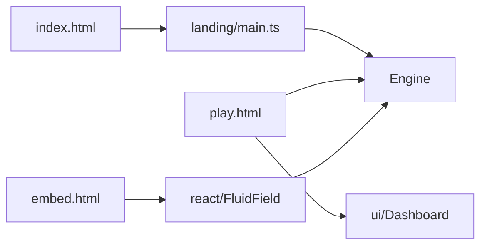

# Landing

## Purpose

Public **showcase** for the wallpaper: a full-viewport WebGL2 field with editorial chrome. It must feel like the product, not a screenshot. The tuner lives at `play.html`.

## Architecture overview

Vite is a multi-page app (`index.html`, `play.html`, `embed.html`) with `base: './'`. GitHub Pages deploys `dist/`. The landing starts `Engine` with one independently authored scene from `scenes.ts` and does **not** mount the React dashboard. Pointer stir still works on the canvas; the glass copy uses `pointer-events: none` except links. React usage lives on `embed.html` ([DEC-008](../../docs/DECISIONS.md)).

## Paradigms

- The hero **is** the simulation. Marketing never replaces the field with a fake loop.
- React stays off this page ([DEC-006](../../docs/DECISIONS.md#dec-006--react-product-shell-dashboard-and-value-drivers)).
- Same engine, same shaders, same look pipeline as the tuner.

## Enforced patterns

- Keep Vite `base: './'` so Pages, local `dist/`, and Wallpaper Engine all resolve assets ([DEC-007](../../docs/DECISIONS.md#dec-007--github-pages-showcase)).
- Do not mount `#dash` / perf HUD / spatial markers / YouTube player here.
- Do not add MUI, analytics SDKs, or getUserMedia.
- Yarn only for the Pages workflow (`yarn test`, `yarn build`).
- Google Fonts are decorative; the field must still run if they fail to load.

## Key files

- `main.ts` — boot Engine, fatal overlay, HMR
- `landing.css` — shell, bento, marquee
- `../../index.html` — markup
- `../../play.html` — tuner entry
- `../../embed.html` — React `FluidField` demo
- `../../.github/workflows/pages.yml` — CI/CD

## The scene collection

A plain visit selects Aurora, Gilded Obsidian or Porcelain Tide with equal probability; repeats are possible. Direct links `?scene=aurora`, `?scene=obsidian` and `?scene=porcelain` select a scene explicitly. Invalid names fall back to random selection. The picker uses normal keyboard-accessible links and marks the current scene. No tuner storage is read or changed.

- **Aurora:** luminous cyan/violet with rose and ice accents, simplex currents and stronger curl.
- **Gilded Obsidian:** gold/dark stone with copper and pale alloy, metallic shading and slower, heavily damped folds.
- **Porcelain Tide:** ivory/indigo with sea-glass and coral accents, matte shading and gentler tidal motion.

All use two complementary full-field sources for immediate coverage, localized accents, four material channels, pointer pigment and a slow sine driver. Palettes tween within their identities. Shared quality: 256 simulation, 768 dye, 28 pressure iterations and 36 warmup steps. These are authored settings, not mobile performance evidence. The UI accent follows the selected scene. Audio and the experimental two-liquid solver are not activated by landing scenes.

`scenes.ts` owns metadata, configs and selection independently of the docs gallery presets. Docs `fluid-hero` pages use their own calm, close-crop settings; landing keeps the fuller showcase look. `main.ts` owns the single Engine and scene presentation. CPU tests cover selection, configuration validity and independent ownership.
