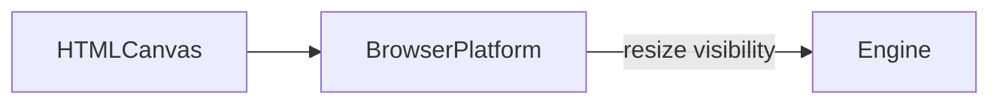

# Platform

## Purpose

Adapt the engine to **this host**: canvas size, device pixel ratio, and page visibility. Wallpaper Engine is a future adapter in this layer, not a leak into `src/sim`.

## Architecture overview

`Engine` constructs `BrowserPlatform`. Resize may reseed if aspect changes. Hidden tabs stop the rAF loop.

## Paradigms

- Host APIs stay here. The solver sees aspect and a WebGL2 context, not `document`.
- One adapter now (browser). A later Wallpaper Engine module should implement the same hooks, not fork the Stam passes.

## Enforced patterns

- Do not read `window.wallpaper*` or `project.json` properties until Phase 4 explicitly asks.
- Do not put ResizeObserver or visibility logic inside `FluidSolver`.
- Cap DPR (currently 2) so wallpaper cost stays bounded.
- Vite `base: './'` remains a packaging concern of the build, not of this class.

## Key files

- `browser.ts` — `BrowserPlatform`
