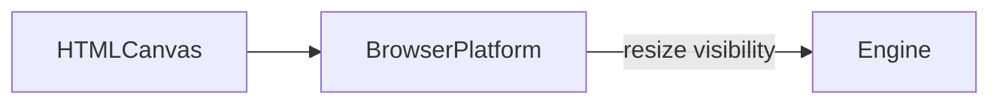

# Platform

## Purpose

Adapt the engine to **this host**: canvas size, device pixel ratio, and page visibility. Wallpaper Engine property/audio APIs are a future adapter in this layer, not a leak into `src/sim`. Desktop packaging consumes `wallpaper.html` ([DEC-019](../../docs/DECISIONS.md#dec-019---multi-host-html-wallpaper-pack)) and relies on this visibility pause today.

## Architecture overview

`Engine` constructs `BrowserPlatform`. Resize may reseed if aspect changes. Hidden tabs stop the rAF loop. The multi-host wallpaper entry uses the same path.

## Paradigms

- Host APIs stay here. The solver sees aspect and a WebGL2 context, not `document`.
- One adapter now (browser). A later Wallpaper Engine module should implement the same hooks, not fork the Stam passes.

## Enforced patterns

- Do not read `window.wallpaper*` or live `project.json` / Lively property listeners until a later Phase 4 task asks. Minimal pack manifests live under `wallpaper/` and are assembled by `scripts/pack-wallpaper.mjs`, not this class.
- Do not put ResizeObserver or visibility logic inside `FluidSolver`.
- Cap DPR (currently 2) so wallpaper cost stays bounded.
- Vite `base: './'` remains a packaging concern of the build, not of this class.

## Key files

- `browser.ts` — `BrowserPlatform`
