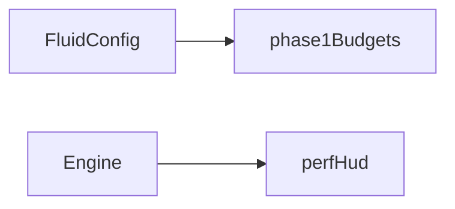

# Quality

## Purpose

Name the **budgets** the rest of the app is allowed to assume. Phase 1 is a fixed sim/dye/pressure triple. Adaptive quality (drop resolution under frame-time pressure) is later.

## Architecture overview

Budgets currently **mirror** `defaultConfig` / live quality keys. The perf HUD observes fps and grid sizes; it does not yet change them. Centralize future adaptive policy here so solvers and shaders do not each invent a throttle.

## Paradigms

- Quality changes should be centralized and observable ([docs/ARCHITECTURE.md](../../docs/ARCHITECTURE.md)).
- Reseed keys (resolution, pressure iterations, warmup) are artist-facing but expensive; they are not driver targets.

## Enforced patterns

- Do not silently store velocity in 8-bit textures if float targets fail — fail with a reason (`src/sim/capabilities.ts`).
- Do not scatter ad-hoc resolution constants through shaders; pass them from config.
- Leave Wallpaper Engine performance APIs unset until a decision exists.
- Keep `pressureIterations` in the Phase 1 band (20–40) unless a recorded decision changes it.

## Key files

- `budgets.ts` — `phase1Budgets`
