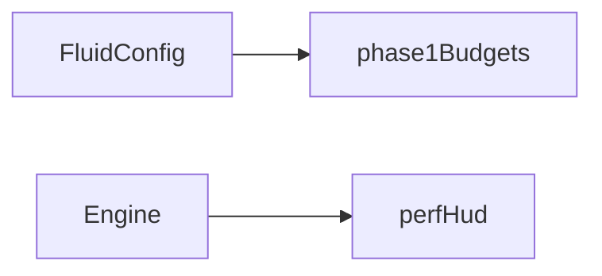

# Quality

## Purpose

The separate `liquidQuality.ts` controller and `gpuTiming.ts` query helper serve only the experimental two-liquid runtime. Fixed-time accounting, statistical windows, hysteresis and allocation limits are implemented; coordinated solver budgets remain unfinished. Read [TWO_LIQUID.md](../../docs/TWO_LIQUID.md) before using these as performance guarantees. The legacy helper below remains descriptive; ECO now uses the shared controller in `eco.ts`.

Name the **budgets** the rest of the app is allowed to assume. Phase 1 is a fixed sim/dye/pressure triple. Adaptive ECO budgets and evidence are owned by [ECO.md](../../docs/ECO.md).

## Architecture overview

Budgets currently **mirror** `defaultConfig` / live quality keys. The perf HUD observes fps and grid sizes; the Engine applies adaptive overrides only when ECO is enabled. Centralize future adaptive policy here so solvers and shaders do not each invent a throttle.

`phase1Budgets` is not wired into Engine as an active quality controller. Proposed mobile tiers in [the review](../../docs/REVIEW_INK_COMPONENT.md) remain experiments and may fall outside current config assertions. Consult [local guidance](AGENTS.md) before changing budgets.

## Paradigms

- Quality changes should be centralized and observable ([docs/ARCHITECTURE.md](../../docs/ARCHITECTURE.md)).
- Reseed keys (resolution, pressure iterations, warmup) are artist-facing but expensive; they are not driver targets.

## Enforced patterns

- Do not silently store velocity in 8-bit textures if float targets fail — fail with a reason (`src/sim/capabilities.ts`).
- Do not scatter ad-hoc resolution constants through shaders; pass them from config.
- Leave Wallpaper Engine performance APIs unset until a decision exists.
- Keep `pressureIterations` in the Phase 1 band (20–40) unless a recorded decision changes it.

## Key files

- `budgets.ts` — `phase1Budgets`

`eco.ts` owns shared ECO levels, overload windows, hysteresis and legacy grid/display ceilings. See [ECO.md](../../docs/ECO.md) for the contract.
