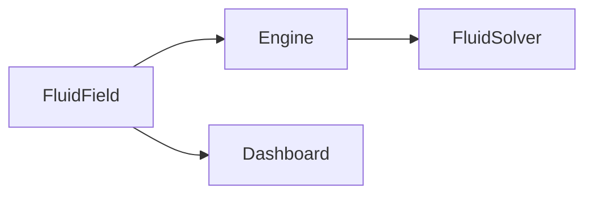

# React embed

## Purpose

A **React host** for the living field: `FluidField` owns a canvas and starts `Engine`. It is how other React apps mount the wallpaper without copying shaders. The solver still lives in TypeScript.

## Architecture overview

`FluidField` is optional. `play.html` and the landing page keep their own boots. This folder does not step the solver or write GLSL.

## Paradigms

- React is a host and optional dashboard ([DEC-006](../../docs/DECISIONS.md), [DEC-008](../../docs/DECISIONS.md)).
- `config` is the **initial** base look. Later edits go through `Engine.applyConfig` / the dashboard.
- `persist` defaults to **off** so an embed does not share the tuner’s `localStorage`.

## Enforced patterns

- Consumers need a bundler that understands Vite `?raw` GLSL imports (this repo’s Vite app, or an equivalent).
- Do not call `getUserMedia`.
- Do not add MUI/shadcn.
- Keep Yarn; package `exports` point at `src/react/index.ts`.

## Key files

- `FluidField.tsx` — canvas, engine lifecycle, optional dashboard/perf
- `resolveFieldOptions.ts` — CPU defaults for flags and config merge
- `index.ts` — public exports
- `embed.tsx` / `../../embed.html` — Pages demo of React usage
