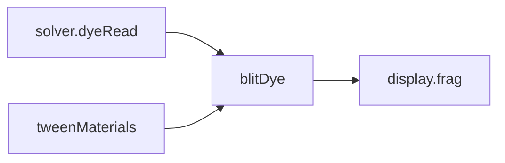

# Render

## Purpose

The opt-in `liquidDisplay.ts` renders unnormalized pigment absorption against an explicit substrate, with independently enabled artistic relief/gloss/detail. `absorption.ts` supplies CPU optical reference math. Its opaque, linear-light contract and unfinished calibration are in [TWO_LIQUID.md](../../docs/TWO_LIQUID.md). Legacy display behavior below is unchanged.

Turn packed **concentrations** into a displayed look: albedo mix, cheap 2.5D lighting, glow, sheen, roughness, metal. This folder does not advect fields.

## Architecture overview

`Engine` calls `blitDye` after `solver.step`. Live material colors may tween; concentrations still come from the dye target. Manual bilinear is a capability fallback, not a look choice. `uVideoReveal` writes canvas alpha so a music/video layer can show through empty dye; default 0 is opaque.

## Paradigms

- Same concentration field, many identities ([DEC-002](../../docs/DECISIONS.md), [DEC-005](../../docs/DECISIONS.md)).
- Display is a fullscreen blit, not a scene graph or PBR material stack.
- CPU helpers in `src/app/shade.ts` / `colorTween.ts` document the grade; the GPU pass must stay aligned.

## Enforced patterns

- No Unity/materials/PBR pipelines unless a later task asks.
- Do not write into velocity or pressure targets from display.
- Do not require IBL, bloom extra targets, or WebGPU.
- Keep tone/glow cheap enough for a wallpaper; quality knobs belong in config, not hardcoded magic in one-off passes.

## Key files

- `display.ts` — `blitDye`, uniforms for live slots
- `../shaders/display.frag.glsl` — look shader
- `../app/shade.ts`, `../app/colorTween.ts` — CPU reference mix
