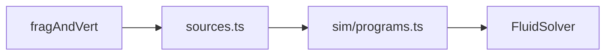

# Shaders

## Purpose

`liquid.frag.glsl` and `liquidDisplay.frag.glsl` are the opt-in original two-liquid passes, imported directly by their dedicated solver/display owners. The first stores transport quantities; the second computes absorption and artistic surface lighting. Their field locations, units, timestep assumptions, residuals and limitations are owned by [TWO_LIQUID.md](../../docs/TWO_LIQUID.md). They are separate from the legacy catalog below.

GLSL ES 3.00 sources for simulation passes and the display blit. Compiled through `?raw` imports and assembled in `sources.ts`.

## Architecture overview

Simulation fragments read/write float (or half-float) targets. `display.frag.glsl` reads dye concentrations and paints look. Shared noise chunks (`noise.glsl`, `perlin.glsl`) are included by marker, not by a second language.

## Paradigms

- Original passes in the Stam / GPU Gems ch. 38 family. Reference techniques; do not paste third-party fluid source.
- Sim vs look: transport shaders must not encode a single branded grade.
- One fullscreen triangle/quad; no mesh assets.

## Enforced patterns

- WebGL2 + GLSL ES 3.00 only unless a later DEC moves the GPU path ([DEC-003](../../docs/DECISIONS.md)).
- No WebGPU shaders in this folder yet (Phase 6).
- Keep inject/wind/composer passes project-owned and cap-aware (`MAX_MATERIALS` / emitters / stations on the CPU side).
- Do not add `#include` that Vite cannot resolve; use `sources.ts` markers.

## Key files

- `sources.ts` — catalog and includes
- `fullscreen.vert.glsl`
- Stam set: `advection`, `jacobi`, `divergence`, `gradientSubtract`, `curl`, `vorticity`, `splat`, `clear`
- Composer / inject: `curlNoiseForce`, `perlinDye`, `marbleSeed`, `marbleVelocity`, `windForce`, `viscosityWeight`
- `display.frag.glsl` — look + optional video-reveal alpha
