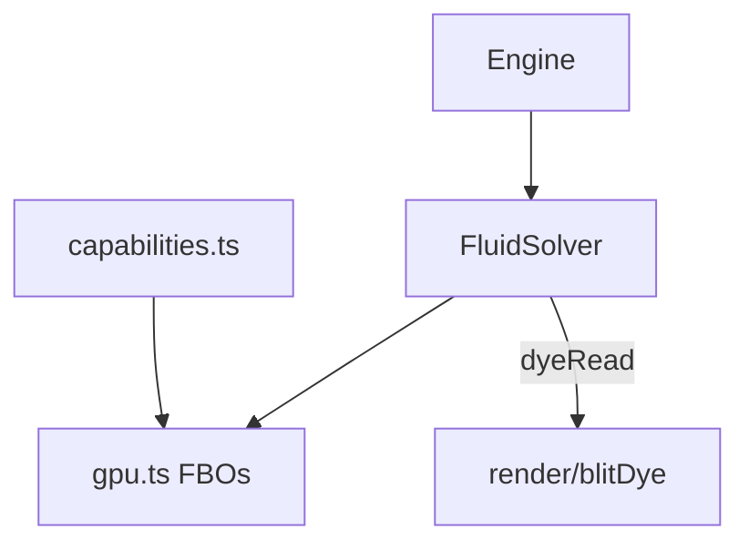

# Simulation

## Purpose

The opt-in `liquidSolver.ts` owns eight RGBA32F fields for the experimental MAC/two-phase path. `liquidNumerics.ts` is its CPU flux/resize reference. Pigment slots follow carrier definitions, never display RGB. Residual readbacks and current limits are documented in [TWO_LIQUID.md](../../docs/TWO_LIQUID.md); do not infer mobile readiness from this prototype.

Run the GPU fluid **transport**: velocity, pressure-like projection, and packed material **concentrations**. This folder decides how fields move, not how they look on screen.

## Architecture overview

`FluidSolver` keeps a **live** `FluidConfig` object supplied by the engine. Passes are original Stam / GPU Gems ch. 38 family work: semi-Lagrangian advection, Jacobi pressure, vorticity confinement, plus project-owned inject/composer/wind.

## Paradigms

- One velocity field; dye is up to four concentration channels, not RGB pigment ([DEC-005](../../docs/DECISIONS.md)).
- Viscosity damping is derived thickness, not a second fluid.
- Detect formats at runtime (`RGBA16F` preferred). Never silently store velocity in 8-bit textures ([DEC-003](../../docs/DECISIONS.md)).

## Enforced patterns

- Do not copy third-party fluid-simulation source. Study the method family; write original passes.
- Do not import React, Wallpaper Engine, or `getUserMedia`.
- Do not decide albedo, glow, or lighting here — that is `src/render` / `display.frag.glsl`.
- Respect caps from `config.ts` (materials, emitters, wind stations).
- Keep simulation independent of optional pointer; composer/warmup must produce a visible field without the mouse.

## Key files

- `solver.ts` — step, warmup, inject, forces
- `gpu.ts` — FBOs, blit, resolution
- `programs.ts` — compiled passes
- `capabilities.ts` — WebGL2 / float render-target selection

`FluidSolver.resample()` transfers pigment and grid-scaled velocity to a replacement solver without seed/warmup, then projects velocity. Its original bilinear GPU pass is `resample.frag.glsl`; it preserves visual state approximately, not exact mass. See [ECO.md](../../docs/ECO.md).
