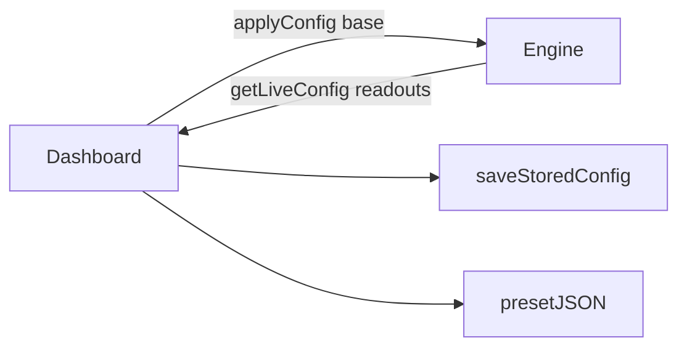

# UI

## Purpose

The in-page **product-shell overlay**: tabbed dashboard, crimson glass styling, and JSON preset file pickers. Artists edit **base** looks here. The canvas artwork must still run with the panel closed.

## Architecture overview

`main.ts` mounts React on `#dash`. Pointer on the canvas is `src/inputs`, not this folder. Perf HUD stays vanilla DOM in `src/app/perfHud.ts` but shares drag/layout helpers.

## Paradigms

- React is shell only ([DEC-006](../../docs/DECISIONS.md#dec-006--react-product-shell-dashboard-and-value-drivers)). No solver steps, no shader strings, no WebGL.
- Controlled rows show **base**; **live** is a readout when a driver is bound.
- Hide with **H**; dragging the header (or Panel button) persists position.

## Enforced patterns

- No MUI/shadcn or other component libraries.
- Persist on user edits, never on the rAF live poll.
- Import presets through `parsePresetJson` → `mergeImportedPresets` → `savePresets`. Fail closed (`console.warn`); do not throw into the engine.
- Do not call `getUserMedia`. Stub driver kinds stay labeled “later”.
- Keep Vite-relative assets; this overlay is part of `dist/`.

## Key files

- `Dashboard.tsx` — dock, tabs, H-to-hide, preset IO
- `rows.tsx` / `format.ts` — numeric/color/select rows
- `dashboard.css` — glass look, ~420px dock
- `presetFile.ts` — download JSON
