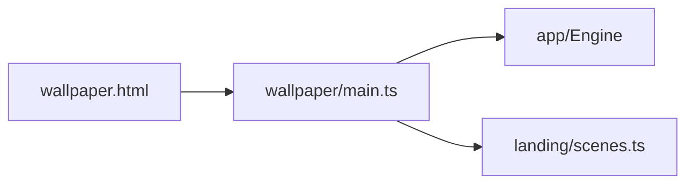

# Desktop wallpaper entry

## Purpose

Full-bleed, offline WebGL2 field for multi-host desktop wallpaper packs (Wallpaper Engine, Lively, Mac HTML hosts). No marketing chrome, React tuner, fonts CDN, or media.

## Architecture overview

`main.ts` selects a landing scene via `?scene=aurora|obsidian|porcelain` (random otherwise), forces a solid offline background, and starts `Engine` with ECO enabled. Visibility pause comes from `BrowserPlatform`.

## Paradigms

- Shared `dist/` entry for all hosts; host manifests live in the pack, not in the solver.
- Reuse authored landing scenes; do not read tuner `localStorage`.
- No Wallpaper Engine or Lively property APIs in this folder until a later Phase 4 decision.

## Enforced patterns

- Keep the entry offline (no external scripts, fonts, or YouTube).
- Do not mount the dashboard, perf HUD, or spatial editor.
- Do not import React.

## Key files

- `main.ts` — boot
- `../../wallpaper.html` — Vite entry

## Validation

Open `dist/wallpaper.html` after `yarn build`. Hide the tab to confirm pause. Pack with `yarn pack:wallpaper`. Host GPU behavior remains device-specific.
