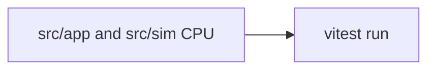

# Tests

## Purpose

Lock **deterministic CPU** behavior: config sanitize, colors, drivers, presets (including JSON documents), panel layout math, and format selection. GPU frames are not asserted here.

## Architecture overview

`yarn test` is `vitest run` with the Node environment ([vitest.config.ts](../vitest.config.ts)). Helpers must not require `localStorage`, WebGL, or `document` unless the test injects them. Preset IO tests parse objects and JSON strings, not downloaded files.

## Paradigms

- Evidence over screenshots: if a sanitize rule matters, it has a unit test.
- Fail closed: unknown preset `kind` and truncated JSON are errors, not silent empty libraries unless the helper documents that.
- Keep tests next to product rules (caps, reseed exclusions, merge-by-name).

## Enforced patterns

- No GPU/e2e in this folder. Do not add Playwright unless a later task asks.
- Do not call `yarn` alternatives; CI should use Yarn ([DEC-004](../docs/DECISIONS.md)).
- Do not invent extra required npm scripts. Validation remains `yarn test` and `yarn build`.
- When config shape changes, update sanitize tests in the same change.

## Key files

- `baseline.test.ts` — main suite
- `ensure-yarn.test.ts` — package-manager guard
