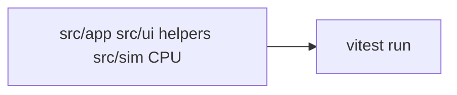

# Tests

## Purpose

Lock **deterministic CPU** behavior: config sanitize, colors, drivers (including emitter `scale`), presets, panel layout math, format selection, UI helpers (range step, UV mapping, graph connect, shortcuts), and `FluidField` option/config merge. GPU frames and React renders are not asserted here.

## Architecture overview

`yarn test` is `vitest run` with the Node environment ([vitest.config.ts](../vitest.config.ts)). Helpers must not require `localStorage`, WebGL, or `document` unless the test injects them. Preset IO tests parse objects and JSON strings, not downloaded files. Do not mount React components.

## Paradigms

- Evidence over screenshots: if a sanitize rule matters, it has a unit test.
- Fail closed: unknown preset `kind` and truncated JSON are errors, not silent empty libraries unless the helper documents that.
- Keep tests next to product rules (caps, reseed exclusions, merge-by-name). Prefer small files over growing `baseline.test.ts`.

## Enforced patterns

- No GPU/e2e in this folder. Do not add Playwright, jsdom, or React Testing Library unless a later task asks.
- Do not call `yarn` alternatives; CI should use Yarn ([DEC-004](../docs/DECISIONS.md)).
- Do not invent extra required npm scripts. Validation remains `yarn test` and `yarn build`.
- When config shape changes, update sanitize tests in the same change.

## Key files

- `baseline.test.ts` — config, colors, sim format, drivers, presets, panel layout
- `drivers-scale.test.ts` — value-emitter `scale` mix and sanitize default
- `field-help.test.ts` — every `controlSchema` row has help
- `ui-range.test.ts` / `ui-uv.test.ts` / `ui-graph.test.ts` / `ui-shortcuts.test.ts` / `ui-duplicate.test.ts` — dashboard helpers
- `react-field.test.ts` — `FluidField` flag/config merge
- `ensure-yarn.test.ts` — package-manager guard
